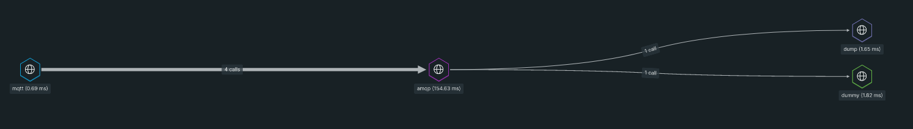

# Rust IoT Example

[](https://codecov.io/gh/ralvescosta/rust_iot)

:warning::construction: **Work In Progress** :construction::warning:

This project was built to understand the maturity of the RustLag ecosystem for the most common IoT Tools, such as: MQTT and RabbitMQ. In this project was build a simples example which receive sames messages through MQTT 3.1.1, republish those messages to RabbitMQ and handle the RabbitMQ events to save this data, and also was created a HTTP and gRPC interface to get the information that has been saved. Was created four binary mqtt, rabbitmq, grpc and http which for the respective protocol.

Also in this project we take care about some well-known practices to web development like: Unit tests, Environment variables, Logging, Tracing and Metrics with Opentelemetry, Containerization and so on.

- **MQTT binary**

  - For MQTT the project has been used the [rumqttc](https://crates.io/crates/rumqttc) create, this create seen good offering a async client based in Tokio.
  - The main ideia for the s.mqtt binary is that receive the IoT data and delivery these data to a RabbitMQ exchange

- **AMQP Binaries**

  - **amqp binary:**

    - The main ideia for the s.amqp binary is that receive the IoT do some works and "notify" the other services about the IoT data.

  - **dummy binary:**

    - The main ideia for the s.dummy binary is that receive the IoT notification and do some works.
  
  - **dump binary:**

    - The main ideia for the s.dump binary is that receive the IoT notification and do some works.

## How can I build the binaries?

Make sure you have the following pre-requirements:

  - rustup@lts
  - rustc@lts
  - cargo@lts
  - protoc@lts

- **To build the MQTT Binary**

  ```bash
  cargo build --binary mqtt
  ```

- **To build the AMQP Binaries**

  - **amqp**

  ```bash
  cargo build --binary amqp
  ```

  - **dummy**

  ```bash
  cargo build --binary dummy
  ```

  - **dump**

  ```bash
  cargo build --binary dump
  ```

## How can I run the project?

Make sure you have the following pre-requirements:

  - docker-ce@lts
  - minikube@lts
  - kubectl@lts

## Future features

- **HTTP binary**

  - For HTTP the project has been used [actix-web](https://crates.io/crates/actix-web) create.
  - The main ideia for the s.http binary is that get the data that has been saved in PostgreSQL and return a friendly JSON.

- **gRPC binary**

  - For gRPC the project has been used [tonic](https://crates.io/crates/tonic) create.
  - The main ideia for the s.grpc binary is that get the data that has been saved in PostgreSQL and return using proto buffer.

## Conclusions:

- **Opentelemetry + Newrelic:**

<p align="center">
  
</p>

## Commands:

- cargo install protobuf-codegen
- cargo install grpcio-compiler
- apt install -y protobuf-compiler
